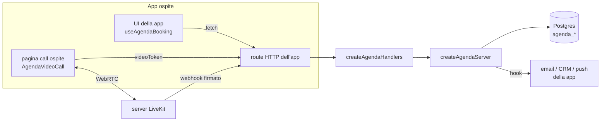

# Architettura

## Principio

Il pacchetto possiede **comportamento e struttura**; l'app possiede **identità e canali**. Nessun valore di progetto nel codice: tutto arriva da configurazione, props o dati. Vedi [[adr-0001-pacchetto-a-configurazione-esplicita]].

## Entrypoint

| Import | Ambiente | File | Contenuto |
|---|---|---|---|
| `/core` | browser + server | `src/core/` | tipi, fusi (`time.ts`), slot (`availability.ts`) |
| `/react` | browser | `src/react/` | `useAgendaBooking`, `AgendaBookingWidget` |
| `/video/react` | browser | `src/video/react.tsx` | `AgendaVideoCall` (unico file che importa LiveKit client) |
| `/server` | server | `src/server/` | `createAgendaServer`, config, mapping righe |
| `/http` | server | `src/http/` | `createAgendaHandlers` |
| `/video/server` | server | `src/video/livekit.ts` | JWT LiveKit e verifica webhook su `node:crypto` |
| `/migrations/*` | — | `migrations/` | SQL |

**Confine browser/server**: `core` e `react` non importano `node:*` né accedono al DB. Importare `/server` da codice client fallisce il bundle, ed è voluto.

## Componenti

## Flusso di prenotazione

1. `GET availability` senza data → giorni prenotabili (nel fuso del tipo di appuntamento).
2. `GET availability?date=` → slot con `available`, calcolati togliendo prenotazioni confermate e blocchi.
3. `POST book` → il server **ricontrolla** che l'orario sia uno slot valido ([[prenotazione-e-disponibilita]]), controlla i blocchi, inserisce. Il vincolo di esclusione del DB rifiuta le sovrapposizioni (409).
4. Hook `onBookingCreated` con `booking`, `guestUrl`, `extra` → l'app manda la conferma ([[link-ospite-ed-email]]).

## Flusso della videocall

1. L'ospite apre `guestUrl` → la pagina dell'app chiama `videoToken` con `bookingId` + `token`.
2. Il server verifica il token, lo stato e la finestra oraria e firma un JWT LiveKit per la stanza `agenda-<id>`.
3. `AgendaVideoCall` mostra la prova dispositivi e si collega.
4. LiveKit invia i webhook → eventi salvati, `video_started_at`, stato «completed» a stanza chiusa. Vedi [[videocall]].

## Configurazione

`AgendaServerConfig` (`src/server/config.ts`): `db`, `eventTypes`, `signingSecret`, `video`, `guestUrl`, `hooks`, `tables`, `logger`, `now`. Gli hook sono attesi dopo la scrittura e i loro errori sono registrati senza annullare la prenotazione.
